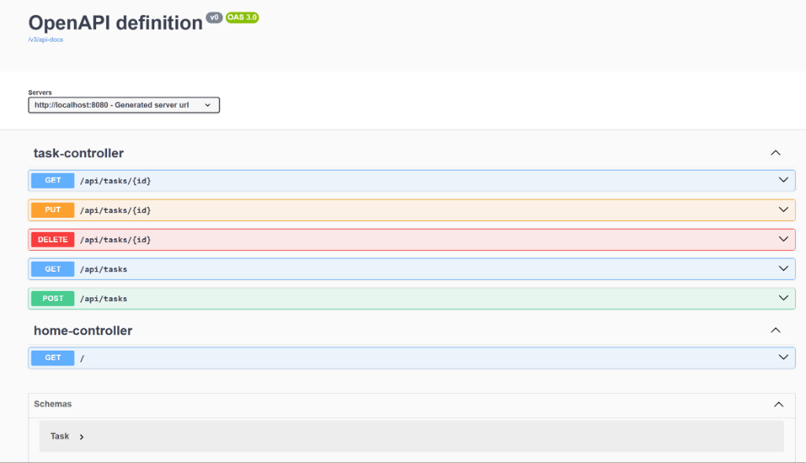
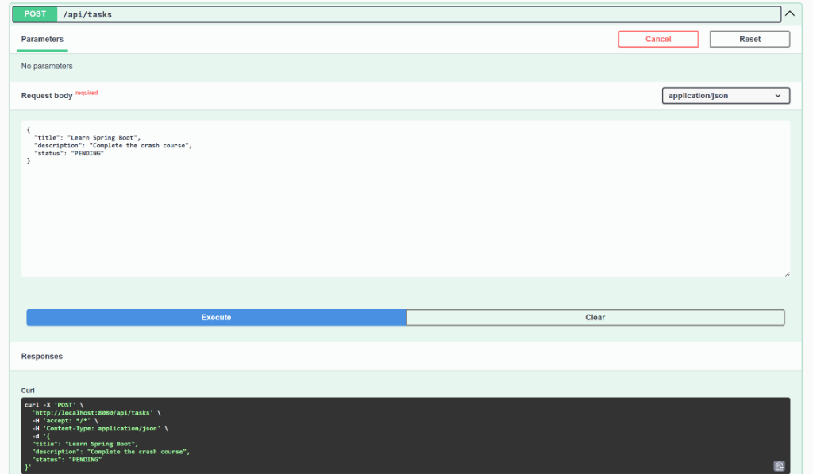
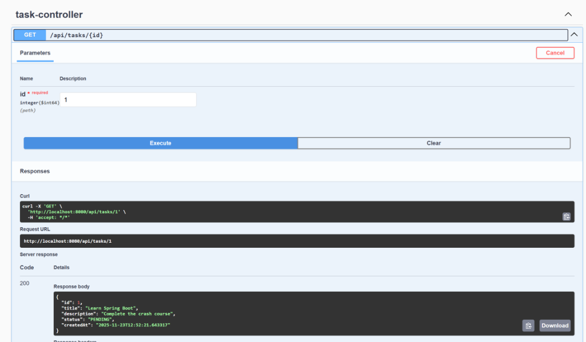
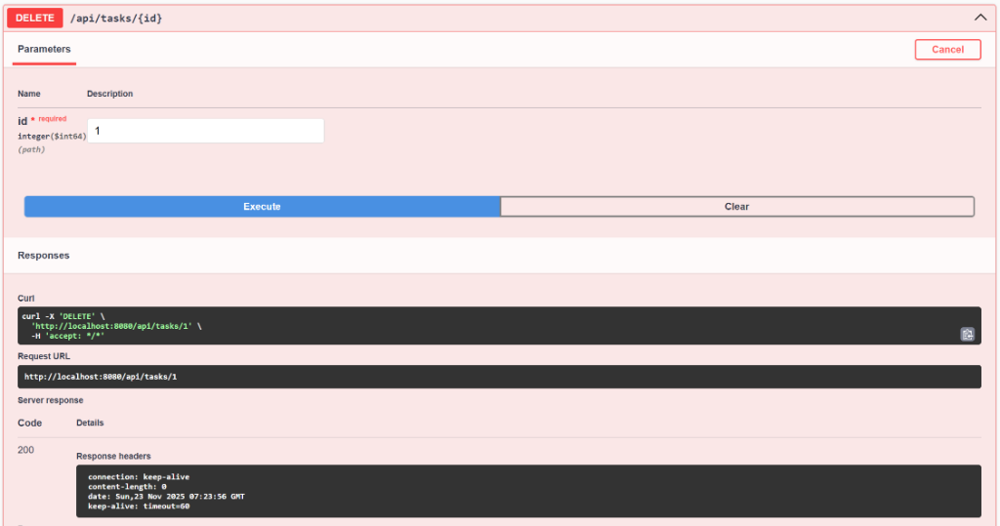

# Task Management System

## Screenshots

### Swagger UI Overview


### Create Task (POST)


### Get Task Details (GET)


### Delete Task (DELETE)


## Description
This is a simple Task Management System built with Spring Boot. It provides a RESTful API to create, read, update, and delete (CRUD) tasks. This project is designed as a fundamental example for a resume, demonstrating core Spring Boot capabilities.

## Features
- **Task Management**:
    - Create new tasks
    - View a list of all tasks
    - View details of a specific task
    - Update existing tasks
    - Delete tasks
- **Database**: Uses H2 in-memory database for easy setup and testing.
- **API Documentation**: Integrated with Swagger UI (OpenAPI) for interactive API exploration.

## Tech Stack
- **Java**: 17
- **Framework**: Spring Boot 3.2.3
- **Database**: H2 Database
- **Persistence**: Spring Data JPA
- **Tools**: Lombok, Maven

## Getting Started

### Prerequisites
- Java Development Kit (JDK) 17 or later
- Maven 3.6 or later

### Installation
1. Clone the repository:
   ```bash
   git clone <repository-url>
   ```
2. Navigate to the project directory:
   ```bash
   cd Java_Project
   ```

### Running the Application
You can run the application using Maven:
```bash
mvn spring-boot:run
```

The application will start on `http://localhost:8080`.

## API Endpoints
| Method | Endpoint | Description |
|--------|----------|-------------|
| GET | `/api/tasks` | Get all tasks |
| POST | `/api/tasks` | Create a new task |
| GET | `/api/tasks/{id}` | Get a task by ID |
| PUT | `/api/tasks/{id}` | Update a task |
| DELETE | `/api/tasks/{id}` | Delete a task |

## API Documentation (Swagger UI)
Once the application is running, you can access the Swagger UI at:
http://localhost:8080/swagger-ui.html


